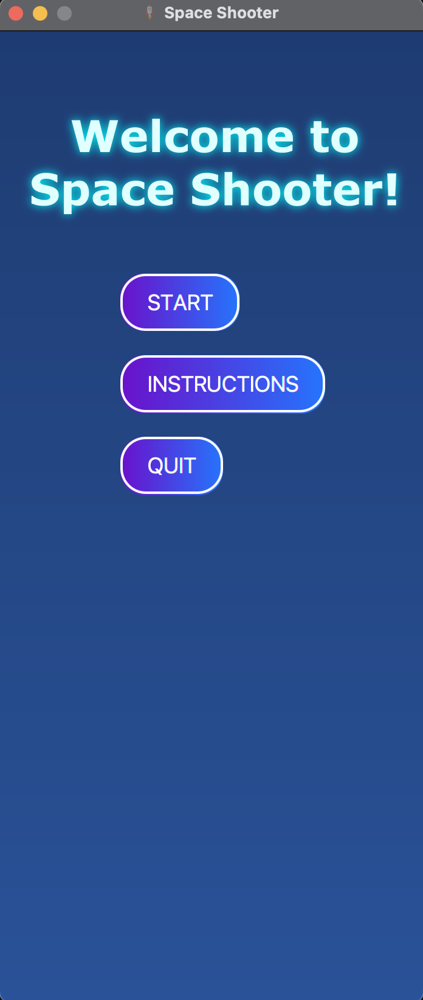
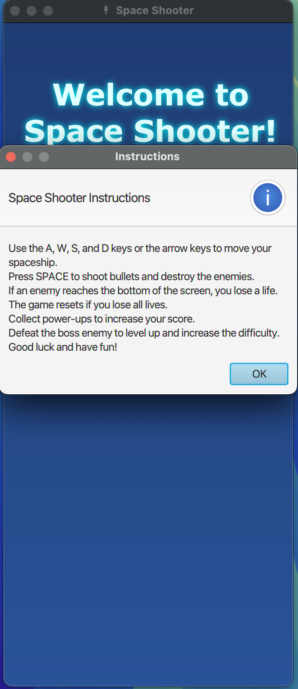
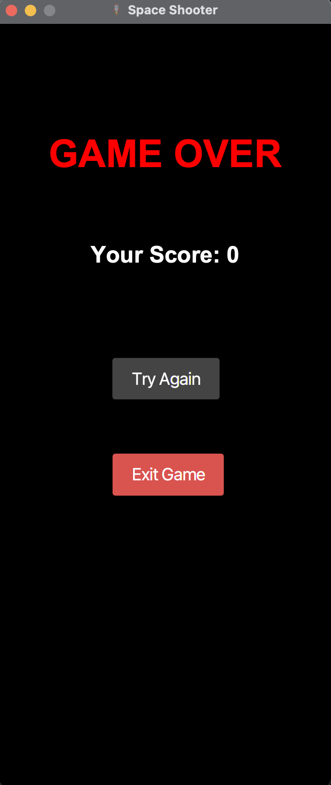

# Space Shooter Game in JavaFX

## Table of Contents

- [Overview](#overview)
- [User Interface](#user-interface)
  - [Start Screen](#start-screen)
  - [Gameplay](#gameplay)
  - [Losing Screen](#losing-screen)
- [Features](#features)
- [Prerequisites](#prerequisites)
- [Setup and Installation](#setup-and-installation)
- [Necessary Configuration](#necessary-configuration)
- [How to Play](#how-to-play)
- [Contributing](#contributing)
- [License](#license)
- [Author](#author)

## Overview

Space Shooter is a simple, lightweight but engaging JavaFX-based game where players navigate a spaceship, avoiding enemies and obstacles while trying to achieve the highest score possible. The game incorporates features such as enemy spawn logic, collision detection, power-ups, and a scoring system, showcasing the capabilities of JavaFX in creating interactive 2D games.

## User Interface

### Start Screen

<p align="center" style="cursor: pointer">
    
</p>

### Gameplay

<p align="center" style="cursor: pointer">
    
</p>

### Instructions

<p align="center" style="cursor: pointer">
    
</p>

### Losing Screen

<p align="center" style="cursor: pointer">
    
</p>

## Features

- Control a spaceship using keyboard inputs (A, W, S, D, or arrow keys) to move and SPACE to shoot.
- Enemies and boss enemies spawn at intervals, increasing the game's difficulty.
- Collect power-ups to boost your abilities.
- Score tracking and display, with the game increasing in difficulty as your score rises.
- Lives system where players lose a life if an enemy reaches the bottom of the screen or collides with the player's spaceship.
- Reset mechanism to start over once all lives are lost.
- Sound effects for shooting, enemy hits, and power-up collection.
- JavaDoc documentation for the game's classes and methods.

## Prerequisites

- JDK 11 or higher.
- JavaFX SDK (version compatible with your JDK).
- Maven (for building and running the project).

## Setup and Installation

1. **JavaFX SDK**: Download the JavaFX SDK from [OpenJFX](https://openjfx.io/) and extract it to a known directory.
2. **Maven Configuration**: Ensure Maven is installed on your system and correctly configured. Alternatively, you can use an IDE like IntelliJ IDEA or Eclipse that supports Maven projects.
3. **Clone the Repository**:
    ```bash
    git clone https://github.com/hoangsonww/Space-Invader-Game.git
    cd Space-Invader-Game
    ```
   
4. **Update `pom.xml`**: Modify the `javafx-sdk.path` property in the `pom.xml` file to point to the JavaFX SDK's location on your system. This is necessary for Maven to build the project correctly.
5. **Build the Project**:
    ```bash
    mvn clean install
    ```
   
6. **Run the Application**:
    ```bash
    mvn javafx:run
    ```
   
    If you're using an IDE like IntelliJ IDEA, you can run the `SpaceShooter.java` file directly to start the game.

## Necessary Configuration

Ensure JavaFX is correctly set up in your development environment:
- **IntelliJ IDEA**:
  1. Go to `File` > `Project Structure` > `Libraries`, add the JavaFX SDK as a library by navigating to its `lib` folder.
  2. Modify your run configuration to include VM options for the JavaFX modules you use, e.g., `--module-path "path/to/javafx-sdk/lib" --add-modules javafx.controls,javafx.fxml,javafx.media`.

- **Eclipse**:
  1. Add the JavaFX SDK as an external JAR to your project's build path.
  2. Adjust the run configurations to include the necessary VM arguments, as shown above for IntelliJ.

## How to Play

- Use the A, W, S, D keys or arrow keys to move the spaceship.
- Press SPACE to shoot at enemies.
- Avoid letting enemies reach the bottom of the screen or colliding with them.
- Collect power-ups to enhance your capabilities and increase your score.
- The game ends when all lives are lost, but you can start over by resetting the game.

## Contributing

Contributions to the Space Shooter game are welcome! Please fork the repository, make your changes, and submit a pull request with your improvements.

## License

This project is licensed under the Creative Commons License. See the [LICENSE](LICENSE) file for more information.

## Author

- [Son Nguyen](https://github.com/hoangsonww)

---

Created with ❤️ by [Son Nguyen](https://github.com/hoangsonww) in 2024.
